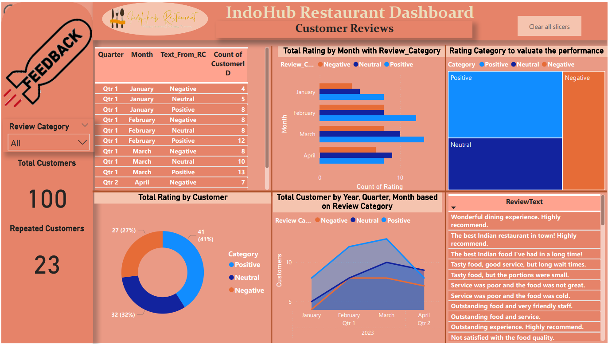

# Restaurant Reviews

## Project Overview
This repository contains a Power BI dashboard for analyzing Indohub restaurant reviews from January'2023 to April'2023. The dashboard provides insights from customer feedback, ratings, and trends over time. The dataset includes reviews and customer information stored in a two different text document file. Data cleaning and transformation were performed using Power Query Editor, and visualizations were created using Power BI. 

## Features
- **Visualizations**: Bar chart, pie chart, and line graphs representing various aspects of restaurant reviews.
- **Data Filters**: Interactive filters to drill down into specific time periods and review categories.
- **KPIs**: Key Performance Indicators for total customers, repeated customer's reviews, number of reviews, and evaluating positive, negative, neutral feedback.

## File Structure
- **/data**: Contains two sample data files (Customer.txt and Reviews.txt) used for the dashboard.
- **/reports**: Contains the Power BI report file (`Customer_reviews.pbix`).
- **/images**: Contains screenshots of the dashboard.

## Getting Started
### Prerequisites
- Power BI Desktop

### Installation
1. Clone the repository:
    ```bash
    git clone https://github.com/Revathi-Gangadaran/Restaurant_Reviews.git
    ```
2. Open `Customer_reviews.pbix` with Power BI Desktop.

### Usage
- Open the Power BI file and navigate through the different tabs to explore the visualizations.
- Use the filters to interact with the data and gain insights.

## Screenshot


## Contributing
Contributions are welcome! Please open an issue or submit a pull request.

## Contact
For any questions or inquiries, please contact [revathigangadaran@gmail.com].

