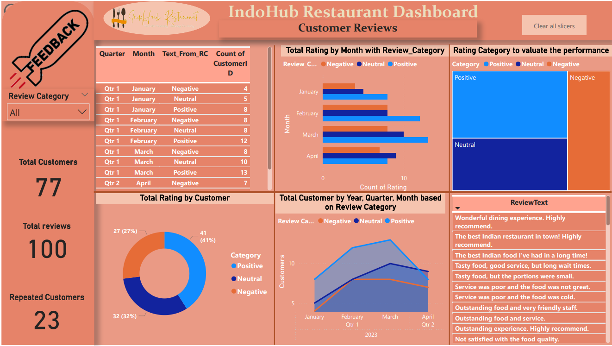

# Restaurant Reviews

## Project Overview
This repository contains a Power BI dashboard for analyzing restaurant reviews. The dashboard provides insights into customer feedback, ratings, and trends over time. The dataset includes reviews and customer information stored in a two different text document file. Data cleaning and transformation were performed using Power Query Editor, and visualizations were created using Power BI. 

## Features
- **Visualizations**: Bar chart, pie chart, and line graphs representing various aspects of restaurant reviews.
- **Data Filters**: Interactive filters to drill down into specific time periods and review categories.
- **KPIs**: Key Performance Indicators for average ratings, number of reviews, and other metrics.

## File Structure
- **/data**: Contains sample data files used for the dashboard.
- **/reports**: Contains the Power BI report file (`.pbix`).
- **/images**: Contains screenshots of the dashboard.

## Getting Started
### Prerequisites
- Power BI Desktop

### Installation
1. Clone the repository:
    ```bash
    git clone https://github.com/Revathi-Gangadaran/Restaurant_Reviews.git
    ```
2. Open `restaurant_review_dashboard.pbix` with Power BI Desktop.

### Usage
- Open the Power BI file and navigate through the different tabs to explore the visualizations.
- Use the filters to interact with the data and gain insights.

## Screenshots


## Contributing
Contributions are welcome! Please open an issue or submit a pull request.

